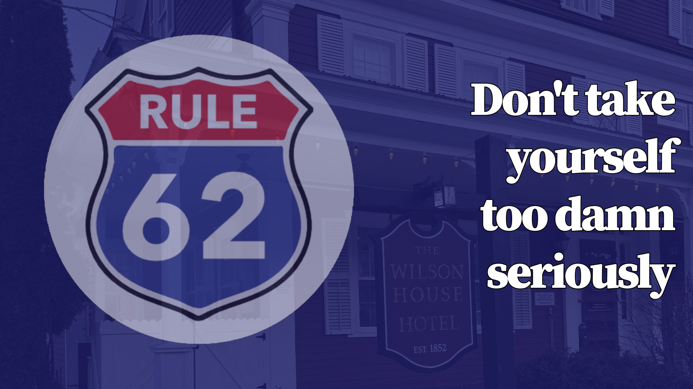

**I have been sober, by the grace of God and the 12 steps of Alcoholics Anonymous (AA), since 11/06/2024.**

- AA emphasizes that recovery is an ongoing process, not a one-time event and that a daily reprieve from addiction is _"contingent on the maintenance of our spiritual condition."_
- One way I maintain my spiritual condition is by attending AA (or similar recovery meetings) daily.
  - Here is my [weekly meeting schedule](assets/pdfs/Western_Mass_AA_meeting_weekly_schedule_4_3_2025.pdf). 

**The following institutions supported my recovery journey**

- [The Plymouth House](https://www.theplymouthhouse.com/)
  - Residential Inpatient Treatment (21 days)
- [Massachusetts Center for Addiction](https://masscenterforaddiction.com/)
  - Partial Hospitalization and Intensive Outpatient Programs (90 days)
- [Peak Recovery Solutions (The Quinn House)](https://www.instagram.com/peak_recovery_solutions/)
  - Men's sober living house (60 days)

**Here are some other resources that I find helpful in maintaining my sobriety:**

- Alcoholics Anonymous // Recovery [YouTube](https://www.youtube.com/@gregpetrucci) playlist I compiled.
<iframe width="560" height="315" src="https://www.youtube.com/embed/videoseries?list=PLWwwqoNqy9pDnTToopi4aYArrE1eHOAM7" title="YouTube video player" frameborder="0" allow="accelerometer; autoplay; clipboard-write; encrypted-media; gyroscope; picture-in-picture; web-share" allowfullscreen></iframe>
- A similar [Spotify](https://open.spotify.com/user/1286606072?si=1531d8aa57064bb0) playlist I made.
<iframe style="border-radius:12px" src="https://open.spotify.com/embed/playlist/4edNOnkeXf2QDiqgLzCt4l?utm_source=generator" width="100%" height="352" frameBorder="0" allowfullscreen="" allow="autoplay; clipboard-write; encrypted-media; fullscreen; picture-in-picture" loading="lazy"></iframe>
